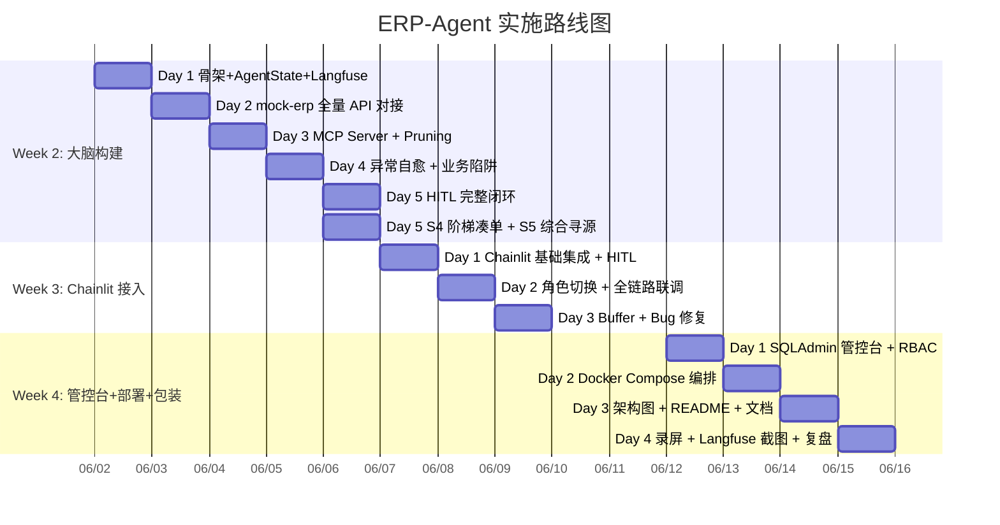

# ERP-Agent 实施计划 (Offer-Oriented 极限 3 周版)

**文档版本**：V1.2 (Chainlit 架构调整版)
**对应版本**：PRD V6.0
**核心原则**：先跑通主线 → 再 enrich 细节 → 永远保持"可演示"状态

---

## 总体路线图



---

## 🚀 Sprint 1: 核心大脑构建 (Week 2)

**目标**：在纯 Python 终端中跑通 Agent 调用 ERP 工具的核心逻辑，覆盖全部 5 个场景。

### Day 1: 骨架 + AgentState + Langfuse 初始化

- [x] **Task 1.1**: 搭建项目目录结构 `[P0 · 30min]`
  - 产出: `erp-agent/app/` 骨架 (agent/ mcp/ gateway/ dashboard/ core/)
  - 验收: `python -m app.agent.graph` 不报错 → ✅ `graph compiled: CompiledStateGraph`
  - 依赖: 先完成 Task 1.5 (pyproject.toml)
  - 参考: 03-Tech-Arch §九

- [x] **Task 1.2**: 定义完整 `AgentState` `[P0 · 20min]`
  - 产出: `app/agent/state.py`
  - 验收: 含全部 13 个字段 + `CartItem` TypedDict + `add_messages` reducer → ✅ 18 fields
  - 参考: PRD §3.2 + 03-Tech-Arch §二

- [x] **Task 1.3**: 搭建基础 `StateGraph` 骨架 `[P0 · 1h]`
  - 产出: `app/agent/graph.py` + `app/agent/nodes.py` + `app/agent/routing.py`
  - 验收: 编译成功，节点间连线无错误 → ✅ `CompiledStateGraph`

- [x] **Task 1.4**: 配置 Langfuse 初始化 `[P0 · 30min]`
  - 产出: `app/core/langfuse.py`
  - 验收: Langfuse module import 正常 → ✅
  - 参考: 03-Tech-Arch §五

- [x] **Task 1.5**: `pyproject.toml` 依赖声明 `[P1 · 10min]`
  - 产出: `erp-agent/pyproject.toml` (fastmcp, langchain-mcp-adapters, langgraph, fastapi, httpx, langfuse ...)
  - 验收: `uv sync` 安装成功 → ✅ 47 packages installed

- [x] **复盘: Day 1**
  - 验收: 全部 5 个 Task 标注 ✅，`StateGraph` 可编译

💡 **关键决策**：节点用函数节点而非 `@tool` 节点，便于在节点内注入 LLM 调用 + MCP 调用 + 错误处理逻辑。

---

### Day 2: mock-erp 全量 API 对接

- [x] **Task 2.1**: 梳理 mock-erp 全部 13 个 API 端点 `[P0 · 20min]`
  - 产出: `app/mcp/server.py` 顶部注释 —— 13 端点的完整映射清单
  - 验收: 清单包含 HTTP Method、路径、入参概要、响应概要，无遗漏
  - 参考: mock-erp `api/v1/` 各 router 文件

- [x] **Task 2.2**: 实现 HTTP Client 层 `[P0 · 40min]`
  - 产出: `app/mcp/client.py` (httpx.AsyncClient, base URL, GET/POST 泛化函数 + 结构化错误)
  - 验收: 已验证对所有文档化端点的调用，包含 GET /products、/departments、/budgets/{id}、/suppliers 以及 POST /pricing/simulate

- [x] **Task 2.3**: 实现全部 10 个 MCP 工具 (裸 JSON，无 Pruning) `[P0 · 1h]`
  - 产出: `app/mcp/server.py` (FastMCP 实例 + 10 个 @mcp.tool() 工具函数 + run() 入口)
  - 验收: 10 工具全部注册 + 端到端验证通过（含 DRAFT→PENDING→APPROVED 两步流转 + 非法流转 ErpApiError 拦截）

- [x] **Task 2.4**: 单独验证每个工具在终端的手动调用 `[P1 · 30min]`
  - 产出: 测试脚本 `scripts/verify_tools.py`
  - 验收: 10 个工具均调通，mock-erp 数据完整

- [x] **Task 2.5**: 接入 MultiServerMCPClient 到 LangGraph `[P0 · 40min]`
  - 产出: `app/agent/mcp_client.py` (MultiServerMCPClient 初始化 + get_tools() 封装)
  - 验收: `client.get_tools()` 返回 10 个 LangChain 兼容工具 → 注入 ToolNode 编译通过 → ✅
  - 参考: langchain-mcp-adapters README, 03-Tech-Arch §3.1 架构图

- [x] **复盘: Day 2**
  - 验收: 全部 10 个工具可调通并返回数据 → ✅ Task 2.5 集成验证通过

⚠️ **注意**：Day 2 专注"通"，不关注响应裁剪。裁剪在第 3 天做。

---

### Day 3: MCP Server + Response Pruning

- [x] **Task 3.1**: 实现 10 个工具的 Pruning 函数 `[P0 · 1.5h]`
  - 产出: `app/mcp/pruning.py`
  - 验收: 每个工具裁剪后结构可用 → ✅ 字段验证通过, 缩减率 25%-61%

- [x] **Task 3.2**: 特别优化 `simulate_purchase` 的摘要策略 `[P0 · 1h]`
  - 产出: 裁剪后 simulate 响应 (推荐供应商保留明细，其余摘要)
  - 验收: Token 缩减 > 80%
  - 参考: 03-Tech-Arch §3.2 pruning 伪代码

- [x] **Task 3.3**: 实现 `agent_reasoning` 强制校验 `[P0 · 30min]`
  - 产出: `app/mcp/interceptor.py`
  - 验收: 空 reasoning 或长度 < 20 被拦截

- [x] **Task 3.4**: 实现 `operator_role` 硬编码 `[P0 · 30min]`
  - 产出: 同上文件，transit_po_status 拦截
  - 验收: LLM 无法操控该参数

- [x] **Task 3.5**: Langfuse 埋点：记录裁剪前后 Token `[P1 · 40min]`
  - 产出: `app/mcp/pruning.py` + `@observe` 装饰器
  - 验收: Trace 中可见 `raw_tokens`、`pruned_tokens`、`compression_ratio`

- [x] **复盘: Day 3**
  - 验收: MCP 全链路可调用，Pruning 生效，Langfuse 可见压缩率 → ✅ 10 工具 MCP 集成通过, 10 工具 Pruning 字段验证+Token缩减通过, `@observe` 埋入 OTel span attributes

⚡ **重点关注**：
- `simulate_purchase` 的裁剪：推荐供应商保留明细，其他供应商仅保留摘要（总价 + 交期 + 评分 + 明细行数）
- `all_quotes` 数组的优化：剔除 `line_details` 中不必要的审计字段，保留 `skipped_suppliers` 的原因

---

### Day 4: 异常自愈 + 业务陷阱

- [x] **Task 4.1**: 实现 `stock_error` 节点 `[P0 · 1h]`
  - 产出: `app/agent/nodes.py` 中 stock_error 函数
  - 验收: 解析 `INSUFFICIENT_STOCK` → 生成替代方案 → 路由到正确方向

- [x] **Task 4.2**: 实现 `tier_suggest` 节点 `[P0 · 1h]`
  - 产出: 同文件中 tier_suggest 函数
  - 验收: 识别阶梯差价 → 生成凑单建议文本 → 保存到 State

- [x] **Task 4.3**: 实现预算预检路由 `[P0 · 30min]`
  - 产出: `app/agent/routing.py` 中 budget_check 逻辑
  - 验收: `check_budget` 后正确路由到继续 / HITL

- [x] **Task 4.4**: 处理全部 6 种结构化错误 `[P0 · 1h]`
  - 产出: `app/mcp/interceptor.py` 错误映射表
  - 验收: 每种错误类型有对应回复模版

- [x] **Task 4.5**: 使用 seed 数据的 5 个业务陷阱场景测试 `[P1 · 1h]`
  - 产出: 手动执行脚本
  - 验收: 每个陷阱 Agent 都能正确处理

- [x] **复盘: Day 4**
  - 验收: 全部 5 个业务陷阱场景手动通过

📋 **5 个业务陷阱的测试方法**：

| 陷阱 | seed 数据 | 验证方式 |
|---|---|---|
| 价格 vs 交期 | 显示器 SUP_A 1000元/15天 vs SUP_B 1200元/2天 | Agent 展示两个选项给用户 |
| 预算红线 | 研发部余额 5000, 椅子 10×600=6000 | Agent 触发 HITL |
| 阶梯凑单 | 鼠标 90个×100元 vs 100个×80元 | Agent 主动提示加购 |
| 库存不足 | 椅子仅 5 把, 用户要 10 把 | Agent 推荐减量 |
| 竞争报价 | 键盘 SUP_A 450元 vs SUP_C 500元 | Agent 综合对比推荐 |

---

### Day 5: HITL 闭环 + S4/S5 场景补充

**上午 — HITL 闭环**：

- [x] **Task 5.1**: 实现 `hitl_override_gate` interrupt 节点 `[P0 · 1h]`
  - 产出: `app/agent/graph.py` 中 interrupt_before 配置
  - 验收: 预算超标时正确挂起

- [x] **Task 5.2**: 实现 `override_purchase_order` 工具调用 `[P0 · 30min]`
  - 产出: `app/mcp/tools.py` 中 override 逻辑
  - 验收: 传入 `override_token` 成功建单

- [x] **Task 5.3**: 实现 resume 后的状态恢复 `[P0 · 40min]`
  - 产出: `app/agent/nodes.py` resume 后处理
  - 验收: 恢复后 AgentState 完整，继续后续流程

- [x] **Task 5.4**: 终端模拟超预算 → 挂起 → 注入 Token → 恢复 `[P1 · 30min]`
  - 产出: 手动测试脚本
  - 验收: 全流程通

- [x] **Task 5.5**: PostgreSQL Checkpointer 配置 `[P1 · 30min]`
  - 产出: `app/agent/graph.py` 中 PostgresSaver
  - 验收: 连接成功，State 持久化

**下午 — S4 阶梯凑单 + S5 综合寻源**：

- [x] **Task 5.6**: 补全 S4 阶梯凑单完整流程 `[P0 · 1h]`
  - 产出: 端到端测试
  - 验收: 用户确认/拒绝后走正确分支

- [x] **Task 5.7**: 补全 S5 综合寻源完整流程 `[P0 · 1h]`
  - 产出: 端到端测试
  - 验收: 多供应商对比展示正确

- [x] **Task 5.8**: 编写 Week 2 集成测试 `[P1 · 30min]`
  - 产出: `tests/test_agent/test_scenario_s1.py` ~ `s5.py`
  - 验收: 5 个场景各有一个集成测试

- [x] **复盘: Day 5**
  - 验收: Terminal 端 5 个场景全部通，HITL interrupt/resume 闭环走通

> **Day 5 结束时验收**：在终端用脚本一次性执行，模拟 5 个场景的全部流程，输出可读日志。

---

🏆 **Sprint 1 里程碑**：终端可执行完整 5 场景测试脚本，HITL interrupt/resume 闭环走通，Langfuse 可见 Trace 数据。

---

## 🧠 Sprint 2: 业务触达与 HITL 审批 (Week 3)

**目标**：将 Sprint 1 的大脑接入 Chainlit UI，完成 HITL 审批闭环。

> **前置条件**：Sprint 1 Langfuse 集成已自动覆盖 Sprint 2（`graph.astream` 已包装 `CallbackHandler`）。

### Day 1: Chainlit 基础集成 + HITL

- [x] **Task 0.6**: 补全 `call_model` 节点 — LLM 调用 `[P0 · 1h]`
  - 产出: `app/agent/graph.py` 中 `build_graph(tools=...)` 生产模式内置 `_call_model` 闭包
  - 验收: `build_graph(tools=mcp_tools)` 编译成功，LLM 调用 + ToolNode + 路由完整 → ✅
  - 依赖: LLM API Key（配在 .env）
  - 参考: PRD §3.5 (LLM 选型), 03-Tech-Arch §八 (System Prompt 模板)
  - 备注: `_call_model` 捕获 LLM 实例 + tools_desc，通过 `llm_with_tools.ainvoke()` 调用，System Prompt 在 `prompts.py` 中定义

- [x] **Task 0.7**: 混合架构重构 — ToolNode + 显式业务节点 `[P0 · 2h]`
  - 产出: `app/agent/nodes.py` + `app/agent/routing.py` + `app/agent/graph.py` + `app/agent/state.py`
  - 职责:
    1. 新增 6 个业务节点: `parse_input`, `analyze_simulate`, `present_options`, `show_alternatives`, `user_resolve`, `confirm_and_submit`
    2. 新增 2 个路由函数: `route_after_analysis`, `route_after_user_choice`
    3. AgentState 新增 3 字段: `user_intent`, `analysis_result`, `alternative_products`
    4. 生产模式图结构: `parse_input → call_model → ToolNode → route_after_tools → analyze_simulate → present_options → confirm_and_submit`
    5. System Prompt 添加输出格式约束（结论/详情/操作）
  - 验收: 13 个测试全部通过 → ✅
  - 参考: 03-Tech-Arch §一（混合架构节点图）

- [x] **Task 1.1**: Chainlit 基础集成 `[P0 · 1h]`
  - 产出: `app/chainlit_app.py` (Chainlit 入口)
  - 职责:
    1. `@cl.on_chat_start` 初始化 thread_id
    2. `@cl.on_message` 接收用户消息，调用 LangGraph
    3. 流式输出结果
  - 验收: Chainlit 启动，用户可发送消息并收到 Agent 回复 → ✅ 13 个测试通过

- [x] **Task 1.2**: HITL 审批弹窗集成 `[P0 · 1h]` ✅
  - 产出: 同文件
  - 职责:
    1. 检测 Agent 返回的 `pending_approval` 状态
    2. 调用 `cl.AskActionMessage` 弹出审批确认框
    3. 用户点击"批准"后调用 `Command(resume=True)` 唤醒 Thread
  - 验收: 预算超标场景 → 弹窗 → 批准 → resume → 建单成功

- [ ] **Task 1.3**: HITL 拒绝处理 `[P1 · 20min]`
  - 产出: 同文件
  - 验收: 用户点击"拒绝" → Agent 回复"采购已取消"

- [ ] **Task 1.4**: interrupt_before 重构 `[P0 · 1h]` **(Sprint 1 Fix 2)**
  - 产出: `app/agent/graph.py`
  - 职责:
    1. 将 `hitl_gate` 节点内的 `interrupt()` 调用迁移到 `compile(interrupt_before=["hitl_gate"])`
    2. 简化 `hitl_gate` 节点逻辑（仅读取 interrupt value，不再自行 interrupt）
    3. 更新所有 HITL 测试用例适配新的中断模式
  - 验收: HITL interrupt/resume 闭环走通，测试全部通过
  - 参考: 03-Tech-Arch §4.2

- [ ] **复盘: Day 1**
  - 验收: Chainlit 可对话，HITL interrupt/resume 闭环走通

---

### Day 2: 角色切换 + 全链路联调

- [ ] **Task 2.1**: 角色切换命令 `[P0 · 30min]`
  - 产出: `app/chainlit_app.py`
  - 职责:
    1. 解析 `/role 采购员` / `/role 财务经理` 命令
    2. 将当前角色存入 `cl.user_session`
    3. 注入到 AgentState 的 `operator_role` 字段
  - 验收: 发送 `/role 财务经理` → 后续操作以该角色身份执行

- [ ] **Task 2.2**: 5 场景全链路联调 `[P0 · 2h]`
  - 产出: 端到端测试
  - 验收:
    - S1 常规采购: Chainlit 发"买 5 台显示器给 IT 部" → 完成建单
    - S2 库存不足: Agent 推荐减量方案
    - S3 HITL: 超预算 → 弹窗 → 批准 → resumed
    - S4 阶梯凑单: Agent 建议加购 → 用户确认/拒绝
    - S5 综合寻源: Agent 展示多供应商对比

- [ ] **Task 2.3**: Bug 修复清单 `[P1 · 30min]`
  - 产出: 修复报告
  - 验收: 无阻塞性问题

- [ ] **复盘: Day 2**
  - 验收: Chainlit 端全部 5 场景畅通

---

### Day 3: Buffer + 边界处理

- [ ] **Task 3.1**: 用户模糊输入处理 `[P0 · 30min]`
  - 产出: `app/agent/nodes.py` parse_input 节点
  - 验收: "就按这个来" → 沿用当前 State

- [ ] **Task 3.2**: 上下文清理策略 `[P1 · 20min]`
  - 产出: `app/chainlit_app.py`
  - 验收: 用户要求重置 → 新 Thread

- [ ] **复盘: Day 3**
  - 验收: 边界场景处理完善

---

🏆 **Sprint 2 里程碑**：Chainlit 端跑通全部 5 场景，HITL 审批弹窗交互闭环，角色切换正常。

---

## 🛳️ Sprint 3: 管控台、部署与资产包装 (Week 4)

**目标**：补齐 ToB 系统的最后一块拼图，完成项目包装，准备投递。

### Day 1: SQLAdmin 管控台 + RBAC

- [ ] **Task 1.1**: `AdminUser` 单表 + 登录接口 `[P0 · 40min]`
  - 产出: mock-erp `app/model/admin.py` + 登录 router
  - 验收: 登录/登出正常

- [ ] **Task 1.2**: SQLAdmin ModelView 配置 `[P0 · 1h]`
  - 产出: `mock-erp/app/dashboard/` 目录
  - 验收: PO、商品等页面可读写

- [ ] **Task 1.3**: `is_accessible` 视图级 RBAC `[P0 · 30min]`
  - 产出: 同上目录
  - 验收: finance 角色看不到"强行审批"按钮

- [ ] **Task 1.4**: "强行审批"反向唤醒功能 `[P0 · 40min]`
  - 产出: 同文件
  - 验收: 点击 → 调用 LangGraph API resume → 注入 override_token

- [ ] **Task 1.5**: Langfuse Trace ID 超链接 `[P1 · 20min]`
  - 产出: 同文件
  - 验收: 点击跳转 Langfuse 详情页

- [ ] **复盘: Day 1**
  - 验收: 管控台可查看数据、RBAC 生效、强行审批可用

---

### Day 2: Docker Compose 编排

```yaml
# docker-compose.yml 核心服务
services:
  postgres:
    image: postgres:16
    volumes: [pgdata:/var/lib/postgresql/data]

  mock-erp:
    build: ./mock-erp
    volumes: [./mock-erp/mock_erp.db:/app/mock_erp.db]
    ports: ["8001:8000"]

  agent:
    build: ./erp-agent
    environment:
      DATABASE_URL: postgresql://...  # ← LangGraph checkpointer
      ERP_BASE_URL: http://mock-erp:8000
    depends_on: [postgres, mock-erp]

  langfuse:
    image: ghcr.io/langfuse/langfuse:latest
    ports: ["3000:3000"]
    depends_on: [postgres]
```

- [ ] **Task 2.1**: 每个服务独立 Dockerfile 可构建 `[P0 · 1.5h]`
  - 验收: `docker build` 成功

- [ ] **Task 2.2**: `docker compose up` 一键拉起 `[P0 · 30min]`
  - 验收: 4 个服务均健康

- [ ] **Task 2.3**: 数据库持久化 `[P1 · 15min]`
  - 验收: 重启后 mock_erp.db 和 postgres 数据不丢

- [ ] **复盘: Day 2**
  - 验收: `docker compose up` → 4 服务全部可用

---

### Day 3: 架构资产 + README

- [ ] **Task 4.1**: Mermaid 架构图 `[P0 · 40min]`
  - 产出: `docs/ARCHITECTURE.md` (4 层解耦 + 双库隔离)

- [ ] **Task 4.2**: README 编写 `[P0 · 1h]`
  - 产出: `README.md` (痛点分析、架构设计、MCP 裁剪对比、一键部署指南)

- [ ] **Task 4.3**: 文档交叉引用梳理 `[P1 · 20min]`
  - 验收: 所有文档链接有效

- [ ] **Task 4.4**: 代码注释扫尾 `[P1 · 30min]`
  - 验收: 关键类/函数加 docstring

- [ ] **复盘: Day 4**
  - 验收: 架构图、README、文档、注释全部到位

---

### Day 4: 录屏 + Langfuse 截图 + 复盘

- [ ] **Task 5.1**: 1.5 倍速"一镜到底"演示录屏 `[P0 · 1h]`
  - 产出: 2-3 分钟视频文件

- [ ] **Task 5.2**: Langfuse Trace 瀑布流截图 `[P0 · 30min]`
  - 产出: PNG 图片 (含裁剪前后对比)

- [ ] **Task 5.3**: MCP 裁剪效果对比图 `[P0 · 20min]`
  - 产出: 压缩率数据截图

- [ ] **Task 5.4**: 面试话术复盘 `[P1 · 1h]`
  - 产出: 自问自答文档 (架构决策、技术难点、量化成果)

- [ ] **复盘: Day 5**
  - 验收: 演示物料齐备

---

🏆 **Sprint 3 里程碑**：一键部署完成，演示物料齐备，可随时面试展示。

---

## 测试策略概览

| 层级 | 工具 | Sprint 1 | Sprint 2 | Sprint 3 |
|---|---|---|---|---|
| Agent 单元测试 | pytest | Day 5 | — | Day 1 补充 |
| MCP 单元测试 | pytest + httpx | Day 3 | — | — |
| HITL 审批测试 | pytest + Chainlit | — | Day 1 | — |
| 全链路集成 | 手动 + 脚本 | Day 5 | Day 2 | Day 4 |
| E2E (Chainlit) | 手动 | — | Day 2 | Day 4 |

---

## 风险与缓解

| 风险 | 影响 | 缓解措施 |
|---|---|---|
| PostgreSQL Checkpointer 配置复杂 | Sprint 1 延后 | Day 1 先用 MemorySaver, Day 5 再换 PostgresSaver |
| Langfuse 与 LangGraph 集成问题 | 观测数据不全 | Day 1 就打通基础 Trace, 后续逐步 enrich |
| Chainlit 与 LangGraph 集成问题 | HITL 不通 | 参考官方文档, Day 1 优先打通 interrupt/resume |
| 5 场景验收条件变化 | 范围蔓延 | 严格控制 Day 目标, S4/S5 若有时间剩余再 enrich |
